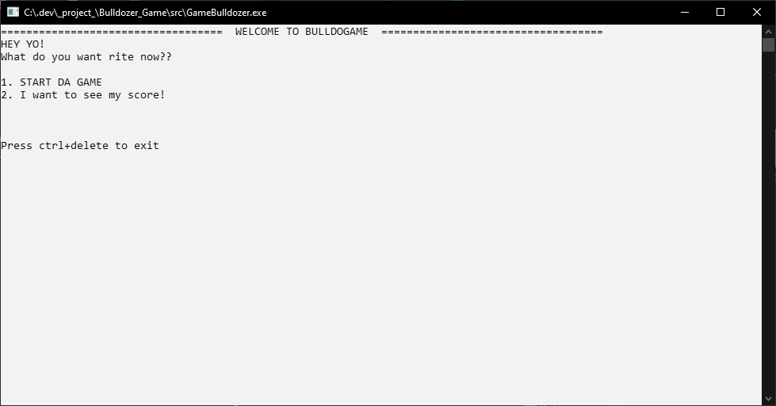
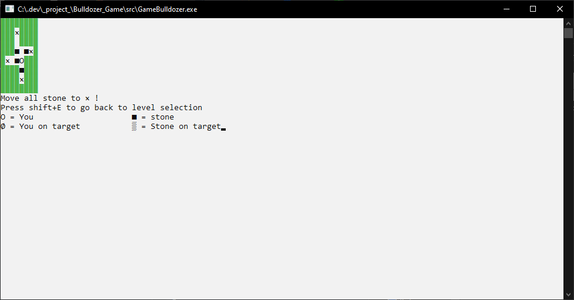
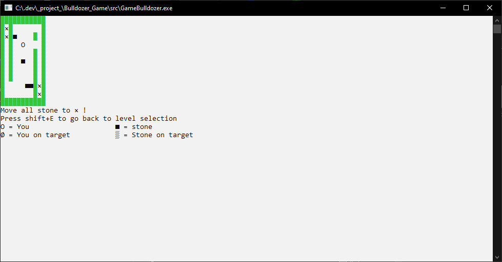
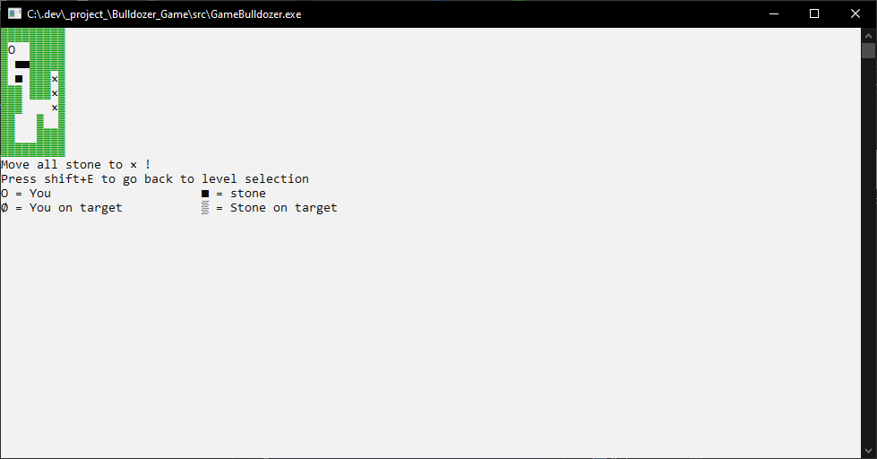

# BOLLDOZER GAME
**Programming 1 Practicum Final Project**

## Overview
**A simple classic bulldozer command prompt game, created with C++ without using a single asset**

Home page view, based on my experience. Some symbol may look different for some reason I don't know

## Game Mechanic

They are 3 ways to move your character:

- Use arrow key
- Use WASD
- Use shift+(HKPM)

## Level

Currently, there are 4 playable level

Level-1

Level-2

Level-3

Level-4

## For Future Update

- Give some comments for guide inside the code
- Add score system based on playtime
- Add more level

Although I don't think I will continue developing this simple game, but maybe, sometimes :)
